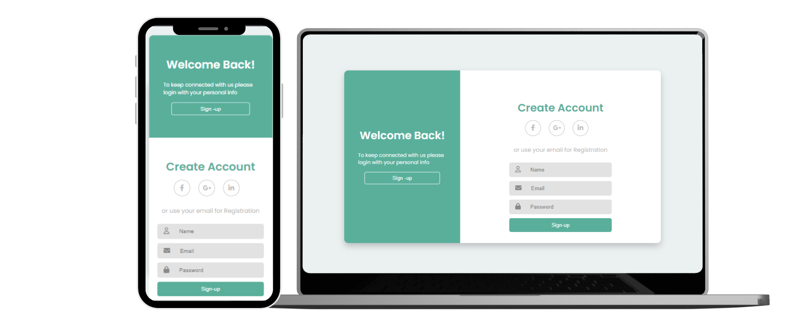

# Formulário Simples com HTML e CSS

## 🎯Objetivo

Desenvolver um formulário Simples usando os conhecimentos adqueridos de HTML e CSS nos módulos iniciais  do curso B7web.

##  💻 Projeto Pronto

## 💻 Tecnologias Utilizadas
1. HTML
2. CSS

## 📗 Bibliotecas de Terceiros
1. Fontawesome
2. Google Fonts

## 💻 Como rodar esse Projeto 
Na sua pasta desejada digite o comando git
~~~
git clone git@github.com:mari-moreira/Formulario-Simples.git
~~~
 

Feito com muito ❤ por Mari 

